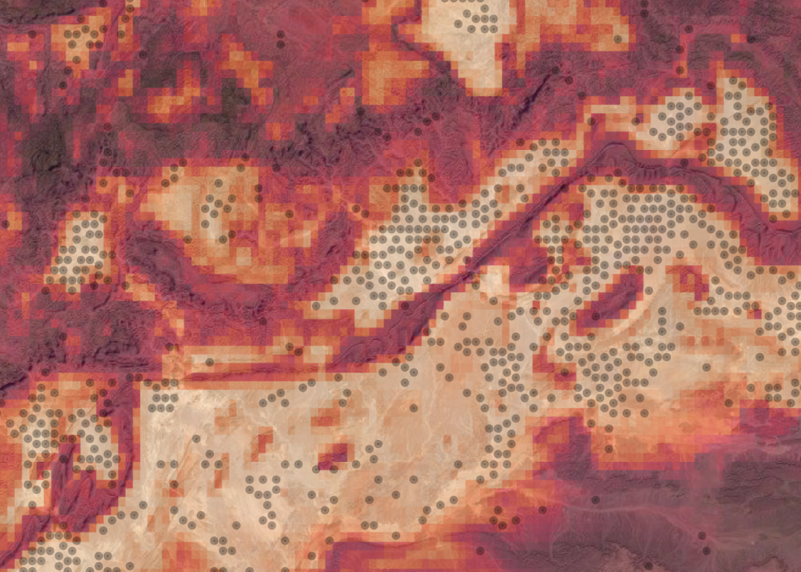
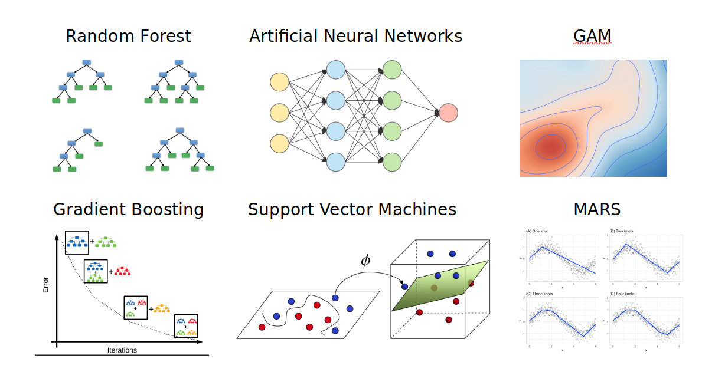
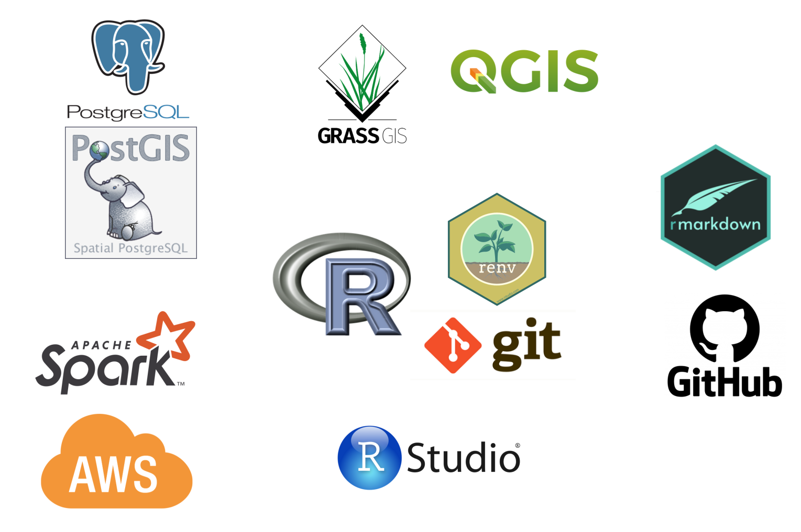

class: left middle

```{r loadpackages, echo = FALSE, message = FALSE, warning = FALSE}
#required libraries
library(tidyverse)
library(xaringanthemer)
library(patchwork)
```


```{r xaringan-themer, include=FALSE, warning=FALSE}
xaringanthemer::style_mono_accent(
  base_color = "#f1605d",
  header_font_google = google_font("Montserrat"),
  text_font_google = google_font("Montserrat"),
  code_font_google = google_font("IBM Plex Mono")
)
xaringanExtra::use_tile_view()
# xaringanExtra::use_animate_all("slide_left")
```

```{r setup, include=FALSE}
options(htmltools.dir.version = FALSE)
```

```{css style settings, echo = FALSE}
@import url(https://fonts.googleapis.com/css?family=IBM+Plex+Mono);

.blockquote {
    padding: 10px  px;
    margin: 0 0 20px;
    font-size: 150%;
    border-left: 5px solid #f1605d;
}

.large { 
  font-size: 250%;
}

.medium { 
  font-size: 200%;
}

.small { 
  font-size: 150%;
}

.tiny {
  font-size: 100%;
}

.content-box { 
    box-sizing: content-box;
    background-color: #e2e2e2;
  /* Total width: 160px + (2 * 20px) + (2 * 8px) = 216px
     Total height: 80px + (2 * 20px) + (2 * 8px) = 136px
     Content box width: 160px
     Content box height: 80px */;
    border-radius: 15px;
    margin: 0 0 25px;
    overflow: hidden;
    padding: 20px;
    width: 100%;
    background-color: #f1605d;
    font-size: 200%;
    color: white;
}

ul {
  list-style: none; /* Remove default bullets */
}

ul li{
 font-size:150%;
}

ul li::before {
  content: "\02192";  /* Add content: \2022 is the CSS Code/unicode for a bullet */
  color: #f1605d; /* Change the color */
  font-weight: bold; /* If you want it to be bold */
  display: inline-block; /* Needed to add space between the bullet and the text */
  width: 1em; /* Also needed for space (tweak if needed) */
  margin-left: -1em; /* Also needed for space (tweak if needed) */
  font-size: 150%;
}

.remark-slide-content.full-slide-fig {
  padding: 0px 0px 0px 0px;
  width: 100%;
}

.remark-code {
  font-size: 26px;
}

.large .remark-code { /*Change made here*/
  font-size: 65% !important;
}

.medium .remark-code { /*Change made here*/
  font-size: 60% !important;
}

.small .remark-code { /*Change made here*/
  font-size: 42% !important;
}
```

# Education

- 2003 Degree in Biology
- 2006 Master's Degree in Environmental Auditing
- **2009 Master's Degree in Geographic Information Systems**
- **2009 PhD in Plant Ecology and Global Change**


---
class: left middle
# Professional experience

- 2006 - 2010 Predoctoral fellow UGR
- 2010 - 2012 Staff researcher Global Change Observatory of Sierra Nevada
- 2012 - 2014 Postdoctoral fellow UGR
- **2014 - 2016 Postdoctoral fellow AU (Denmark)**
- **2016 - 2019 Postdoctoral fellow UiB (Norway)**
- 2020 - 2021 Staff researcher UA (Spain)

---
class: left middle
#Research focus

- Ecoinformatics (a.k.a. *Biodiversity Informatics*)
- Biogeography
- Ecological niche and species distributions
- Machine Learning methods in ecology

---
class: center middle
#One question about ecological phenomena: <br><br> WHY WHERE?

---
class: center middle

```{r echo=FALSE, out.width="100%", out.height="100%"}

```

---
class: left middle
.center[
.small[**Spatio-temporal scope**]
.small[
Local (10m<sup>2</sup>) to Global, 130kaBP to 2100.
]
]

.pull-left[
.small[**Responses**]

.tiny[
- Biodiversity metrics
- Phenological indices
- Frost risk
- Species interactions
- Soil carbon
]
]

.pull-right[
.small[**Predictors**]

.tiny[
- Climate
- Topography
- Remote sensing
- Soil data
- Land-use
]
]

---
class: center middle
#Methods

```{r echo=FALSE, out.width="100%", out.height="100%"}

```

---
class: center middle
#Workflow

```{r echo=FALSE, out.width="100%", out.height="100%"}

```

---
class: left middle
#R development

- `spatialRF`: spatial modelling with Random Forest.
- `distantia`: time-series comparison.
- `memoria`: time-series memory analysis.
- `virtualPollen`: mechanistic population model.

---
class: center middle

.large[If you need to know more: [www.blasbenito.com](https://www.blasbenito.com)]

---
class: center middle
#That's all, thank you!